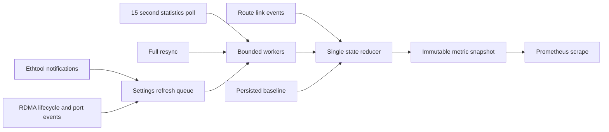

# go-link-monitor design

Status: proposed implementation; documentation reviewed on 2026-10-06. There is
no executable in this directory yet. [METRICS.md](METRICS.md) specifies the
metrics and inventories the reference exporters.
[DETAILED-DESIGN.md](DETAILED-DESIGN.md) specifies the reusable Go library,
background collection, concurrency, I/O backends and implementation test plan.

## Purpose and scope

Provide the primary Ethernet and RDMA port monitoring endpoint for mixed Linux
machines without configuring an expected port count for each machine. Learn the
correct operationally up count on first installation, persist it, and expose
both missing and additional links. Detect reduced negotiated speed, half duplex,
reduced InfiniBand link width, brief link flaps, and
traffic errors. The monitoring system evaluates alerts; this process observes
and exports data and never changes network configuration.

V1 includes link inventory, state, NIC identity, standard interface statistics,
driver and PHY statistics, channels, rings, and RoCEv2/native InfiniBand port
state, capabilities and counters. Host protocol statistics corresponding to
`netstat -s` are also included, with all available fields selected by default.
Socket inventories, routing, qdisc, bonding summaries, conntrack, IPVS, XFRM and network
filesystem metrics are inventoried but deferred. Wi-Fi is outside the wired
interface scope. This does not replace every node_exporter collector in v1.

Run in the host network namespace with matching read access to sysfs, or deploy
one instance per intended namespace with a separate state directory. There is no
automatic namespace traversal. Prometheus supplies host/instance labels.

## Existing components and sources

- The [link-state analysis](../../docs/netlink/link-state-tracking.md) and
  [xtcpnl decoders](../../pkg/xtcpnl/xtcpnl_ethtool.go) provide stateless route,
  generic-netlink discovery, and ethtool decoding, with real kernel replay tests.
  They do not provide a live subscription/reconciliation service.
- Reference go-link-monitor: local `/home/das/Downloads/go-link-monitor`,
  revision `ce856a7af2d5ec0e49e90a6fdd105ef6497e6ad9`; see its
  [monitor loop](https://github.com/randomizedcoder/go-link-monitor/blob/ce856a7af2d5ec0e49e90a6fdd105ef6497e6ad9/pkg/linkmonitor/monitor.go).
  Retain its operational-up predicate, settling idea, SIGUSR1 operation and
  periodic resync. Replace filename-encoded persistence with versioned JSON,
  and use current minus baseline rather than its target-minus-current deficit.
- The node_exporter and ethtool source revisions and API references are recorded
  in [the metric inventory](METRICS.md#source-provenance).

Implementation will use a thin `cmd/go-link-monitor` and public `pkg/linkmonitor`
with private implementation packages for transport, inventory, reducer,
persistence and collection, plus a separate Prometheus adapter. This supports
future embedding in xtcp2 without starting another HTTP server or installing
library-owned signal handlers. Add
RDMA discovery, port-event, capability and counter adapters behind injectable
interfaces; verify userspace device access and required libraries in packaging. Reuse
existing public decoder signatures. Add typed carrier counters, link statistics,
channels and missing extended ring attributes to xtcpnl with presence semantics;
add bounded ioctl adapters for driver/PHY statistics and identity. Existing
nicinfo collection is useful evidence but its best-effort skipping and zero-for-
unknown speed are insufficient as the monitor's state model.

## Interface selection and health policy

Enumerate every interface dynamically, including initially down ports. Include
hardware-backed wired Ethernet, USB Ethernet, guest NICs (such as virtio-net),
and SR-IOV VFs, including RoCEv2 Ethernet ports. Discover native InfiniBand
ports independently of IPoIB netdevices as described below. Include physical members of bonds; exclude the bond device itself.
Exclude loopback, veth, VLAN, bridge, tunnel, Wi-Fi and switch representors.

Classification combines link type/kind and sysfs device/driver metadata. Ethernet
ARPHRD alone is insufficient. Check wireless metadata before including a device;
use device ancestry for physical/guest/VF evidence. For switchdev devices resolve
devlink port flavour when needed to distinguish physical ports from representors;
do not classify by interface-name patterns or driver name alone. Missing or
contradictory evidence yields `unknown`, an inventory diagnostic, and blocks a
new baseline until resolved. It must not silently remove a previously included
device from a healthy snapshot. Tests inject metadata and devlink responses.

An Ethernet interface counts as up when IFF_UP is set and operstate is UP, or when
operstate is UNKNOWN and IFF_RUNNING is set. Preserve carrier, admin state and
operstate separately. DORMANT is not operationally up. Neither up nor carrier
proves end-to-end connectivity. Kernel flag distinctions are documented in
[Operational States](https://docs.kernel.org/networking/operstates.html).

On every up Ethernet interface (including RoCEv2):

1. Compare negotiated speed with the highest known NIC-supported Ethernet mode.
   In LINKMODES_OURS, the mask is supported modes and the value is advertised
   modes. Do not substitute advertised or peer-supported speed for NIC capability.
2. Require full duplex independently of speed.
3. Evaluate each port against its own supported maximum. Do not compare speeds
   between ports sharing a driver: one driver can support both 10GE and 100GE
   devices. Driver identity remains diagnostic metadata, not a speed policy.

Use an exhaustive reviewed UAPI index-to-speed table for the pinned kernel
headers, supporting at least 10 through 800000 Mbps and both compact and verbose
bitsets. Non-speed capability bits do not enter the maximum. Unrecognized set
bits that might encode a faster mode make the maximum unknown, not a guessed
lower maximum. Missing mask, empty usable modes, unknown speed/duplex sentinels,
zero negotiated speed on an up port, unsupported operations and expired samples
produce unknown checks. Preserve raw values internally. Convert speed as
`uint64(mbps) * 1000000`.

Down ports have not-applicable speed and duplex checks; their counters remain
collected. Missing driver identity does not prevent a speed check when the port's
capabilities are available. See the
[LINKMODES API](https://docs.kernel.org/networking/ethtool-netlink.html#linkmodes-get).

## RDMA ports: RoCEv2 and native InfiniBand

RDMA is included in v1. Discover RDMA devices/ports through RDMA netlink and
`/sys/class/infiniband`, preserving link_layer, state, phys_state, rate and
netdevice associations. Determine RoCEv2 availability from GID type metadata;
Ethernet link layer alone does not establish RoCE version. Missing GIDs are not
proof that hardware lacks RoCEv2. Keep capability/configuration availability
separate from physical link health. The
[kernel RDMA sysfs ABI](https://github.com/torvalds/linux/blob/master/Documentation/ABI/stable/sysfs-class-infiniband)
defines port and GID metadata.

Use `rdma:<device>:<port>` (for example `rdma:mlx5_0:1`) as the canonical
`interface` label for native InfiniBand, even when an IPoIB interface exists.
An information metric associates this identity with the RDMA device, port and
any netdevices. Never require IPoIB to monitor a native port. Multiple IPoIB
P_Key interfaces are aliases/upper devices, not extra links. Internal identity
also includes namespace, hardware identity and generation; renaming an RDMA
device changes labels and invalidates name-based exception matching.

For RoCEv2, correlate the RDMA port to its underlying eligible Ethernet netdevice
using kernel associations, not matching names or driver strings. That netdevice
is the canonical monitored link and is counted once. VLAN/GID aliases are not
additional physical links. Keep RDMA port state as an independent diagnostic;
an Ethernet-up/RDMA-inactive combination fails the RDMA readiness check without
inventing a second physical link. Report ambiguous associations as unknown and
block initial baseline creation rather than double-counting. Software RDMA
providers (RXE/SIW) are excluded from the hardware-port inventory. Hardware VFs
remain included as previously selected.

For native InfiniBand, operational up means logical state ACTIVE (4) and physical
state LINK_UP (5). INIT or ARMED with physical carrier is not operationally up.
Do not depend on an IPoIB device's IFF_UP. The persisted total is now the number
of up eligible Ethernet links plus up native InfiniBand ports, with RoCE counted
only through Ethernet. Optional capability/counter queries do not gate count
learning; discovery and port state must be complete. An existing baseline is
never silently rewritten because the tool learns about additional RDMA ports;
operators explicitly rebaseline after reviewing the changed inventory.

Native maximum-speed detection must use supported local port capabilities,
including supported speed generations and supported widths. Read local PortInfo
and applicable extended capability fields through a bounded read-only UMAD GET
adapter; use rdma-core's ibportstate query logic as the reference. No MAD SET,
remote fabric sweep or subnet-manager changes are authorized. Enabled modes can
be administratively restricted and must not replace supported modes. Unsupported
or inaccessible capability queries produce unknown, not the currently active
rate as a fabricated maximum. See
[rdma-core ibportstate](https://github.com/linux-rdma/rdma-core/blob/master/infiniband-diags/ibportstate.c).

Compare active and maximum rates using one documented nominal rate convention,
including lane count; do not compare nominal signalling rate to payload throughput.
Use a reviewed mapping for supported speed/width combinations (SDR through XDR
as supported by pinned headers); preserve unknown future encodings. Do not simply
multiply independent maxima if the device reports constraints on combinations.
Also require active width to equal supported maximum width, so a narrowed link
is visible even if a rate comparison alone is inconclusive. Expose active width,
maximum width, active speed generation and derived rates independently. Sysfs
`rate` reflects active speed/width, not the hardware-supported maximum; node's
help text is not a capability query. The
[kernel rate conversion](https://github.com/torvalds/linux/blob/master/drivers/infiniband/core/verbs.c)
is a reference for active width/speed interpretation.

RoCEv2 retains Ethernet's measured full-duplex check. Native InfiniBand is a
full-duplex transport without an Ethernet half/full negotiation field. Export
`duplex=full,source=transport` once native link layer is verified, and mark its
negotiated `full_duplex` check not_applicable, not unknown or a synthetic measured
pass. An unidentified link layer stays unknown. Link state, speed and width
remain actively checked. See the vendor's
[InfiniBand interface attributes](https://docs.nvidia.com/networking/display/NVIDIANVOSUserManualforInfiniBandSwitchesv25024014/InfiniBand%2BInterface%2BCommands).

Subscribe to RDMA device lifecycle notifications where supported and use a
bounded RDMA event adapter for verbs port-active/port-error/device-fatal events;
events enqueue authoritative port queries. The userspace verbs event API is
additional implementation work, not covered by existing xtcpnl decoding. Every
15s statistics/settings pass and full resync also reconciles RDMA port state,
rate, width and counters. Loss, unsupported event delivery or a closed event
source is observable through collector status; polling remains the recovery
path. No netlink-only claim is made for native port event coverage. See
[verbs asynchronous events](https://github.com/linux-rdma/rdma-core/blob/master/libibverbs/man/ibv_get_async_event.3).

Collect applicable node_exporter InfiniBand/RoCE counters in v1, including link
downed/recovery, symbol errors and RDMA hw_counters. Preserve source units,
reset lifetimes and port scope. They can cover a shared physical resource across
VFs and must not be added to Ethernet carrier or traffic totals. A link_downed
counter is its documented error-related down count, not proof of every possible
flap. Read counters without resetting them. Apply the same freshness, first-sample
and discontinuity rules as Ethernet; native ports do not require ethtool rings,
channels or PHY statistics. Those collectors are not applicable on that transport.

## Maximum-speed exceptions

`-max-speed-exceptions` accepts a comma-separated list of exact interface names;
`GO_LINK_MONITOR_MAX_SPEED_EXCEPTIONS` supplies the same list when the flag is not
explicitly present. Default is empty. An explicitly supplied flag replaces the
whole environment value, including an empty flag clearing it. Trim surrounding
whitespace, deduplicate names, reject empty elements within a nonempty list and
invalid names; do not interpret globs or regular expressions. Resolve at startup
and on inventory changes. Configuration changes take effect on restart.

Names such as `eno1`, `ens6f0` and `ib0` are accepted. An IPoIB name must resolve
to exactly one native RDMA port; it selects that port without adding a link.
Also accept `rdma:mlx5_0:1` for RDMA ports with no IP interface. A selector for a
RoCE port resolves to its canonical Ethernet link. Unmatched or ambiguous names
do not exempt anything: emit match status and a warning, and keep monitoring.
Exceptions do not follow interface renames automatically; resolved targets are
re-evaluated against current names, never remembered solely by reused ifindex.

An exception permits a known below-maximum speed (including the corresponding
native IB maximum-width policy). It does not exempt link-down/count changes,
RDMA readiness, duplex failure, missing/unknown capability data, collector health
or flap/error counters. Continue exposing actual speed, supported maximum and
the raw failed check; export a separate exception gauge and gate only the speed/
width alert expressions. Do not replace the reported hardware maximum with a
configured speed, or record exceptions in the count baseline.

```sh
go-link-monitor -max-speed-exceptions=eno1,ib0
GO_LINK_MONITOR_MAX_SPEED_EXCEPTIONS=ens6f0,rdma:mlx5_0:1 go-link-monitor
```

## Baseline lifecycle

Default `-baseline-file=/var/lib/go-link-monitor/baseline.json`. Record:

```json
{"version":1,"expected_up_links":4,"recorded_at":"2026-10-06T12:00:00Z"}
```

Validate version, nonnegative integer count, timestamp, and a 64 KiB file size
limit. Missing file means first installation; malformed, unreadable or unsupported
version means a startup error, not permission to replace an established baseline.
The state belongs to this host/namespace deployment and must not be cloned to
another host as configuration. Baseline count has no interface-name dependency.

Acquire a lifetime advisory lock on a sibling lock file before loading state.
First installation requires a complete reconciled inventory and a 30-second
period with no eligible membership or operational-up changes. Reconcile again
before committing; changes restart settling. Zero is valid after a complete
verified inventory. Optional statistics/speed failures do not block count learning.

Create new directories with 0750 and files with 0600, subject to umask, without
chmod of existing directories. Save through a same-directory temporary file,
write, fsync, close, rename and parent-directory fsync. Publish the new baseline
only on durable success. If failure occurs after rename, report indeterminate
durability, retain the old in-memory baseline, and retry the same intended
record; do not claim the old on-disk file necessarily remains. Cleanup errors
must remain observable.

Existing baseline is immediately available after load; current/delta metrics
wait for a complete inventory. Restart never relearns the count. SIGUSR1 requests
a fresh reconciliation and replacement with the current up count, without the
initial settle delay. Coalesce repeated requests. Failed collection or saving
retains the previous in-memory baseline. Expose baseline readiness and persistence
errors. No automatic rebaseline follows hardware addition, removal or failure.

## Collection and reconciliation



Subscribe to RTNLGRP_LINK before the initial dump. Discover the ethtool family
and monitor multicast group at runtime. Authenticate kernel senders using socket
metadata, match replies by sequence and expected command/device, handle ACKs and
errors separately, and require successful multipart completion. RTM_NEWLINK can
be an update in either direction. LINKMODES notifications trigger authoritative
GET queries; there is no general LINKSTATE notification to replace rtnetlink.

Use separate event and request sockets. The reducer alone mutates interface
state, keyed internally by namespace, ifindex and device generation. Increment
generation after deletion/recreation and invalidate late queries. RDMA queries additionally
carry the RDMA device/port generation; they cannot update a recycled port name. Rename moves
labels and removes old metric series. Attribute absence in an event does not
clear unrelated cached fields. Clear speed/duplex validity immediately on down;
query on up and retry negotiation at 1s, 2s, 4s, then at the statistics interval.

Full reconciliation builds a candidate inventory while the event reader keeps
running. Mark interfaces touched during the dump dirty; do not replay queued old
descriptions over the completed dump. Re-query dirty indices after draining the
event queue; accept a response only if its generation and request-start revision
still match. ENODEV confirms removal. Repeat for changes during queries. Publish
the reconciled inventory atomically only after a complete, non-interrupted pass;
continued churn keeps reconciliation unhealthy and retries without blocking live
event updates. This is eventual convergence, not a kernel-wide atomic snapshot.

Full resync runs at startup, every `-resync` interval, after event loss/reconnect,
and before rebaseline. It refreshes identity, eligibility, settings, counters,
channels and rings. Inventory success and optional collector success are separate:
an unsupported PHY does not invalidate the complete link inventory. Partial
inventory dumps never replace the last complete inventory.

Statistics polling refreshes standard, carrier, driver, PHY and host protocol statistics every
15 seconds, including down Ethernet and RDMA devices. Also refresh speed/duplex on this tick to
bound detection latency for renegotiation without notifications. Rings/channels
refresh on startup, full resync and relevant notifications. Full resync joins or
supersedes pending polls instead of creating duplicate work. Cache string sets
but revalidate their counts and refresh on identity/configuration changes and
each full resync. Re-query names and values if their dimensions disagree.

Use four workers and one outstanding request per device/collector. Coalesce
poll ticks and dirty-interface refreshes; never create a goroutine per missed
tick. Apply a 5-second request budget; socket operations have deadlines. A
blocking ioctl cannot necessarily be cancelled by a Go context: mark its result
late, discard it on return, and do not launch replacement workers without bound.
Worker exhaustion is a collector health failure; route events still run.

Detect ENOBUFS, MSG_TRUNC, interrupted dumps, decode failures of required data,
closed sockets and application queue overflow. Reconnect and reconcile using
1-second exponential retry capped at 30 seconds. Do not enable NETLINK_NO_ENOBUFS
to conceal loss. RDMA event gaps additionally mark rdma_events unhealthy until recovered.
A bounded event queue of 4096 records uses overflow as an
explicit loss signal. Unknown unrelated attributes/commands are not malformed
required data. Log bounded error classes; do not use error strings as labels.

## Host protocol statistics and field selection

Include the netstat collector in v1. Read `/proc/net/snmp`, `/proc/net/netstat`
and `/proc/net/snmp6` in the monitored network namespace at startup, every
`-stats-interval` (15s by default), and during full resync. Do not execute or parse
the human-readable `netstat -s` command. Discover protocol/field pairs from the
files, including Ip, Icmp, IcmpMsg, Tcp, Udp, TcpExt, IpExt and MPTcpExt when
present, plus IPv6 fields. New kernel fields are eligible automatically.

Use the node_exporter-compatible flag name `-collector.netstat.fields`, default
`.*`. Match a Go regular expression against the case-sensitive key
`<protocol>_<field>`, without a metric prefix (for example `Tcp_RetransSegs`).
Matching is unanchored unless the expression supplies `^` and `$`, as in
node_exporter. A supplied expression replaces the default. Compile it at startup;
invalid expressions fail configuration validation. An empty expression matches
everything under Go regexp semantics; use `^$` to select no fields. Selection of
no fields is intentional and successful, not an unsupported collector. Changing
the filter requires restart. The flag may also be written with two leading
hyphens. Driver/PHY `-stats-include` and `-stats-exclude` do not filter host data.

```sh
# All available host protocol fields (also the default).
go-link-monitor -collector.netstat.fields='.*'
# All base TCP and extended TCP fields.
go-link-monitor -collector.netstat.fields='^(Tcp|TcpExt)_.*$'
# A selected set, using original kernel field names.
go-link-monitor -collector.netstat.fields='^(Tcp_RetransSegs|TcpExt_TCPTimeouts|IpExt_InOctets)$'
# Select no host protocol fields.
go-link-monitor -collector.netstat.fields='^$'
```

Export `go_link_monitor_netstat_<protocol>_<field>` as untyped values with source
units and no interface labels, matching node_exporter's heterogeneous family
semantics. Some values are cumulative counters, others gauges or enums; retain
signed values such as Tcp_MaxConn=-1. Do not add `_total` or infer counter type
from the field name. These namespace-wide values must not be attributed to NICs.

Validate paired headers/values and reject malformed files rather than publishing
misaligned fields. Publish a complete collector snapshot atomically. Missing
optional snmp6 on an IPv6-disabled kernel is supported; absent protocol groups
have no series. A read/parse failure retains the last snapshot with failure and
freshness diagnostics, expiring values after three polling intervals. Remove
fields absent from a later successful snapshot. An intentionally empty selection
still validates source reads. Use the common collector diagnostics with
`collector="netstat",interface=""` to indicate namespace scope; failure does not
invalidate link inventory or baseline readiness. Scrapes remain cache-only.

## Flaps and counter lifecycle

Read IFLA_CARRIER_CHANGES, IFLA_CARRIER_UP_COUNT and IFLA_CARRIER_DOWN_COUNT, with
sysfs carrier counter fallback when attributes are absent. Compare successive
samples even if the interface is up at both samples. Retain uint64 raw statistics
and the actual kernel counter width; missing fields are not zero. Standard
traffic statistics prefer IFLA_STATS64. A legacy 32-bit fallback must carry its
width and cannot infer multiple wraps between samples.

For example: carrier_down_count changes from 8 to 10 while operational state
remains up. The metric has increased by two and supports a flap alert despite
an unchanged up-link count. Define a flap for alerts as one down occurrence.
Total carrier changes are transitions, not complete down/up pairs; never divide
by two. Transmit carrier errors count packet transmission errors, not link flaps.

Collect arbitrary driver/PHY statistics independently. A driver may record a
physical transient that never reaches the kernel carrier state. Export its raw
value, but normalize a flap counter only with a reviewed mapping identifying
driver, exact statistic, meaning, width, reset lifecycle and source evidence.
V1 starts with no guessed driver mappings; mappings are added with driver source
or vendor evidence and tests. Raw collection does not depend on mappings.

Keep kernel carrier, verified driver-down and monitor-observed operational
transitions separate. They can overlap or count different phenomena. Never sum
them into an authoritative flap total or subtract observed events to estimate
exactly how many were missed. Monitored operational-down transitions can include
administrative changes and are not labelled physical flaps.

First samples establish comparison state, not new historical events. On a
decrease, count a discontinuity and restart comparison; infer wrap only when
counter width and other evidence make it unambiguous. Unobserved reset followed
by growth past the old value cannot always be detected. Changes in device
generation, boot identity or selected source invalidate comparisons. Raw source
values remain raw, including resets; do not synthesize lifetime totals.

Do not persist flap totals in the count baseline. Process-observed counters reset
on process restart. Source counters survive process restart only to the extent
the kernel/device retains them, and may reset on reboot/driver reload/device
replacement. Counter collection cannot recover events that hardware never
records or that reset before being sampled. Prometheus floating-point exposition
loses integer precision above 2^53, despite exact internal arithmetic.

## Metrics, freshness and operation

All application metric families use `go_link_monitor_`; their exact contract is
in [METRICS.md](METRICS.md). Default HTTP address is `:9101`, path `/metrics`.
Expose `/healthz` for process liveness and `/readyz` for loaded/committed baseline
plus healthy inventory/event collection. Optional ethtool failures do not fail
readiness; they have independent alerts. HTTP handlers read immutable snapshots.

Retain per-collector snapshots on transient failure, with success=0 and the old
last-success timestamp. Expire poll-derived values after three statistics
intervals (45s by default); stop emitting their numeric series and mark policy
checks unknown. Configuration snapshots expire after two resync intervals.
Event-driven state remains available with collection_healthy=0 following loss;
it is not represented as verified current state. An overdue full reconciliation
(more than two resync intervals) also makes collection unhealthy. No timestamps
are supplied on metric samples: freshness gauges communicate cached sample age.

Unsupported capabilities omit values and set
`collector_support{status="unsupported"}=1`, without fabricating zeros.
Support is a one-hot supported/unsupported/unknown state and is unknown until
probed; a fourth not_applicable state covers collectors that do not apply to
the transport (for example Ethernet rings on native InfiniBand).
Raw driver/PHY include/exclude regular expressions
operate on original names; include defaults to `.*`, exclude to `^$`. All reported
statistics, including per-queue names, are eligible by default. Bound each string
set at 65536 entries; reject oversized or inconsistent responses visibly rather
than silently exporting a prefix. Names are label values, never metric-name
fragments. Preserve exact valid UTF-8 names; invalid byte strings use a reversible
hex representation and an encoding label. Duplicate identical names in a set
invalidate that set because name-to-value mapping would be ambiguous.

No scrape-time I/O means updates become externally visible on the next scrape.
Use a 15s scrape interval as the example deployment. Polling can lag by a poll
interval plus query time; full resync is the inventory/configuration safety net.
A count can stay constant when one interface goes down and another comes up:
per-interface state and counters provide the missing detail.

Standalone command flags:

| Flag | Default | Contract |
|---|---|---|
| `-metrics-addr` | `:9101` | HTTP listen address |
| `-baseline-file` | `/var/lib/go-link-monitor/baseline.json` | Persistent state |
| `-settle` | `30s` | Nonnegative initial stable interval |
| `-resync` | `1h` | Positive full reconciliation interval |
| `-stats-interval` | `15s` | Positive statistics/settings interval |
| `-stats-include` | `.*` | Original driver/PHY names to include |
| `-stats-exclude` | `^$` | Original names to exclude; exclusion wins |
| `-collector.netstat.fields` | `.*` | Case-sensitive Go regexp on protocol_field; all host protocol fields by default |
| `-max-speed-exceptions` | empty | Exact names/selectors; overrides GO_LINK_MONITOR_MAX_SPEED_EXCEPTIONS when present |
| `-version` | false | Print build identity and exit |
| `-io-backend` | `poller` | Ordinary nonblocking sockets by default; explicit `io_uring` requires supported backend initialization |

Both single- and double-dash forms work. Only maximum-speed exceptions have an
environment override. Unknown flags and positional arguments fail with exit 2;
configuration errors also exit 2, runtime errors exit 1, and help/version or clean
termination exit 0. Help/version perform no monitoring or baseline I/O. Version
output reports version, revision and build date; the build metric has only the
documented version/revision labels. Logs use structured text on stderr.

Build the full Linux RDMA executable with `nix build path:.#go-link-monitor`;
`path:.#go-link-monitor-core` explicitly omits the native bindings. Both install
`bin/go-link-monitor`. No additional capabilities are granted by these packages.
The remaining netclass metadata gap in STATUS still prevents a claim of complete
v1 metric coverage. Service/OCI deployment is a later increment.

Run with a dedicated service identity and writable state directory. Determine
read and multicast permissions against target kernels; retain explicit permission
errors. Do not require or grant CAP_NET_ADMIN merely to change settings, since
no settings are changed. Network namespace/sysfs access and any necessary
read-side capability must be verified by deployment tests. Native RDMA also
requires matching sysfs/RDMA namespace visibility and read/query access to the
necessary uverbs/umad devices; lack of access must report unknown/failed collection,
not a healthy speed result. Do not require write-side fabric configuration. SIGTERM cancels work,
closes sockets/HTTP cleanly and releases the baseline lock. No alert sending,
packet capture, shelling out to ethtool, or physical-NIC reconfiguration occurs.

## Acceptance and implementation sequence

1. Add pure model, selection policy, baseline store and metric contract tests.
2. Add live route/generic transport and reconciliation around existing decoders.
3. Add standard/carrier counters, ioctl statistics, channels and extended rings;
   RDMA discovery/events, read-only port capability queries and RDMA counters;
   host protocol collection with configurable field selection.
4. Add cached Prometheus export, CLI/service wiring and failure diagnostics.
5. Validate physical hardware before asserting fleet coverage.

Future tests use table descriptions and expected outcomes, fake clocks/transports,
race tests, existing two-kernel fixture replay, and explicitly separate physical
tests. Required scenarios:

| Area | Acceptance |
|---|---|
| Baseline | Stable first start, zero inventory, restart/reboot reuse, +/- delta, SIGUSR1, corrupt/oversized file, permission errors, fsync/rename failures, competing processes |
| Selection | Hardware, USB, guest, VF, bonded member; excluded virtual/Wi-Fi/representor; unknown metadata and hotplug |
| State | Admin down, carrier down, dormant, unknown operstate; duplicate events, rename, deletion, namespace move, ifindex reuse, equal-count port substitution |
| Settings | 10/100/200/400/800GE, half/unknown duplex, supported versus advertised mask, unknown mode bits, mixed-capability ports sharing a driver without cross-port comparison |
| RDMA | RoCEv2 plus native IB, no IPoIB, multiple P_Keys, PF/VF associations, no double counting, ACTIVE versus INIT/ARMED, unknown GID version, permissions, event loss, reduced lane width, SDR through XDR mappings and transport-defined duplex |
| Exceptions | CLI/env precedence including explicit empty override, deduplication, invalid syntax, unmatched/ambiguous name, rename/ifindex reuse, IPoIB alias and RDMA selector; speed/width failures remain visible while duplex/down/unknown alarms remain active |
| Reconciliation | Startup events, changes during dump/requery, late replies, interrupted/partial dump, ACK/error handling, overflow, reconnect, continued churn |
| Flaps | Down/up between polls with unchanged up count; multiple flaps, missed notifications, overlapping sources, first sample, reset/wrap, source changes and replacement |
| Statistics | Missing versus zero, large uint64, 32-bit fallback, names/count changes after channel reconfiguration, duplicate/non-UTF-8 names, oversize responses, all queues and filters |
| Host protocol filter | Default includes every available protocol/field including ICMP type histograms and MPTCP; anchored/unanchored selections, case sensitivity, empty/all/no-match expressions, invalid regexp, signed values, newly added/removed fields, malformed pairs, missing optional IPv6, independent failure/stale expiry |
| Isolation | Unsupported PHY, denied ioctl, stuck driver worker, bounded pending work, stale expiry, non-overlap of poll/resync, continued fast event updates |
| Metrics | Types/units/labels, consistent concurrent scrapes, series removal, reset behavior, optional values, examples parsed by promtool when implemented |
| Hardware | Supported-mode maxima, physical short flaps, driver counter meaning/reset behavior and query cost on representative Ethernet/RoCEv2 and native InfiniBand HCAs; virtual fixtures do not prove these |

Documentation verification checks source-to-inventory coverage, links, formulas,
defaults and cross-document metric names. This documentation change does not run
hardware experiments or claim the daemon has been implemented or tested.
