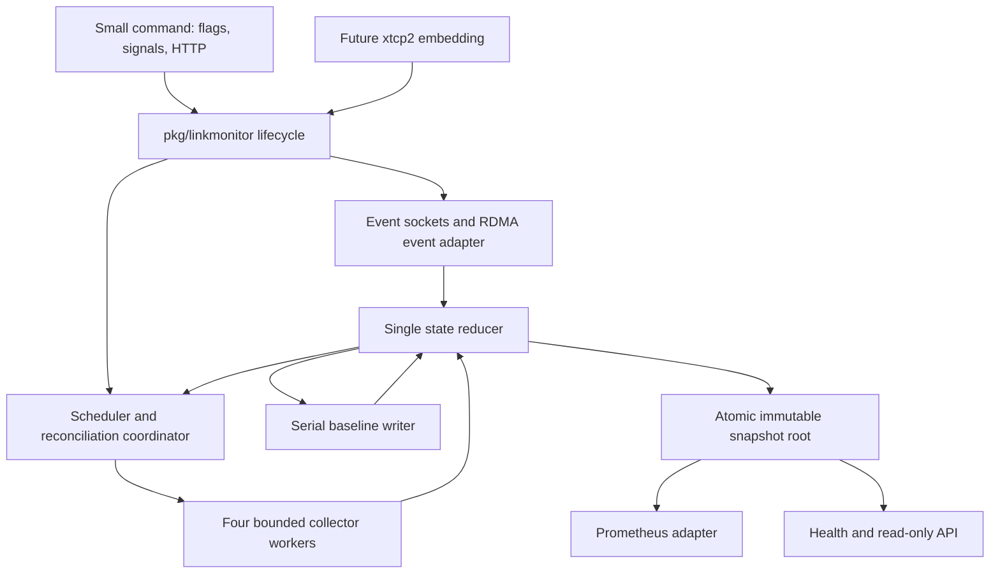

# go-link-monitor detailed Go design

Status: implementation underway, reviewed against the working tree on 2026-10-06.
P01/P02 now provide a tested library foundation, pure Ethernet/RDMA policies and
baseline persistence. P03-T01/T02 add single-owner reducer state, exact counter
histories and paged immutable publication. Live collection, freshness, metrics serving and
the standalone command remain to build. STATUS records completed gates; the
remaining design and test matrix below are specifications, not verified results.

[DESIGN.md](DESIGN.md) owns monitoring behavior, eligibility, baseline semantics,
RDMA policy and defaults. [METRICS.md](METRICS.md) owns exported names, types,
labels, units and freshness. This document defines their Go implementation.
It supersedes the earlier internal-only package placement: the monitor will be
an importable `pkg/linkmonitor` library with private implementation packages.

[IMPLEMENTATION-PLAN.md](IMPLEMENTATION-PLAN.md) breaks this design into phased
tasks and completion gates. [STATUS.md](STATUS.md) tracks task progress,
verification evidence, blockers and the next action.

## 1. Goals and architecture

Optimize total collection cost and event-to-snapshot latency, while keeping
scrapes independent of kernel/driver latency. Ethernet, RoCEv2, native
InfiniBand and namespace-wide netstat statistics are all v1 requirements.
All driver/PHY and host protocol fields remain selected by default.

The design uses concurrent I/O producers and a single owner of mutable monitoring
state. Workers never update Prometheus vectors. Scrapes read an immutable
snapshot. This gives each scrape a coherent view of related values such as
current count, baseline and delta, without a global scrape/update mutex.



### Package boundaries

The following boundaries span implemented and planned packages; STATUS records
which parts currently exist and have passed their gates:

| Location | Responsibility | Must not own |
|---|---|---|
| `cmd/go-link-monitor/main.go` | Call `run`, report its error, set exit status | Collection loops, parsing kernel records, metric definitions |
| Other command files | Flag/env conversion, build identity, signal bridge, HTTP lifecycle | Monitoring policy or source counter arithmetic |
| `pkg/linkmonitor` | Public API; reducer, scheduling, reconciliation, policy and snapshot publication | Global registry, HTTP listener, process exit, signal handlers |
| `pkg/linkmonitor/internal/model` | Private identities, jobs, observations, schemas and immutable blocks | Kernel I/O or Prometheus objects |
| `pkg/linkmonitor/internal/linuxio` | Socket owners, request matching, backend selection, message envelopes | Device policy or baseline decisions |
| `pkg/linkmonitor/internal/ethernet` | Classification evidence, ethtool requests/ioctls, stats/name caches | Shared mutable monitor state |
| `pkg/linkmonitor/internal/rdma` | Discovery, association, event, local capability and counter adapters | Fabric configuration or remote sweeps |
| `pkg/linkmonitor/internal/hoststats` | Bounded procfs reads, paired-field parsing and compiled field selection | Per-interface attribution |
| `pkg/linkmonitor/internal/baseline` | Lock/load/atomic durable save, injected filesystem operations | Choosing when to learn or replace a count |
| `pkg/linkmonitor/prometheus` | Custom collector over public read-only snapshots | Scrape-time device reads or independent freshness policy |
| Existing `pkg/xtcpnl` | Reusable pure wire builders/decoders and additive typed fields | Live monitor lifecycle |
| Existing `pkg/io_uring` | Reusable optional ring primitives after required extensions | Monitor policy, unsafe concurrent ring access |

Dependency direction is command/embedding -> public library and exporter ->
private adapters -> xtcpnl/io_uring. Private packages use the private model,
not the public monitor, avoiding import cycles. The core package does not import
Prometheus; another application can consume snapshots without exporting metrics.
Keep interfaces at I/O, time and storage boundaries. Pure policy functions accept
concrete value types rather than introducing interfaces for every struct.

## 2. Public API and embedding

These sketches describe the public API now introduced by P01, with private
internals developed in subsequent phases. All public slices/maps passed to
constructors are copied. Configuration becomes immutable after construction.
The current live `Run` returns `ErrBackendUnavailable` until the real adapters
are wired; fake sessions exercise the lifecycle without pretending to collect.

```go
type IOBackend string
const (
    IOBackendPoller  IOBackend = "poller"
    IOBackendIOUring IOBackend = "io_uring"
)

type Config struct {
    BaselineFile       string
    Settle             time.Duration
    Resync             time.Duration
    StatsInterval      time.Duration
    StatsInclude       string
    StatsExclude       string
    NetstatFields      string
    MaxSpeedExceptions []string
    IOBackend          IOBackend
}

type Options struct { Logger *slog.Logger }
type Monitor struct { /* private state */ }
type Snapshot struct { /* private immutable root pointer */ }
type Health struct {
    Running, Ready, CollectionHealthy, BaselineReady bool
}

func DefaultConfig() Config
func New(cfg Config, opts Options) (*Monitor, error)
func (m *Monitor) Run(ctx context.Context) error
func (m *Monitor) RequestResync() error
func (m *Monitor) RequestRebaseline() error
func (m *Monitor) Snapshot() Snapshot
func (m *Monitor) Health() Health
func (s Snapshot) Version() uint64
func (s Snapshot) Health() Health
func (s Snapshot) RangeDevices(visit func(DeviceView) bool)
func (s Snapshot) RangeSamples(visit func(SampleView) bool)
```

`DefaultConfig` supplies all DESIGN defaults plus `IOBackendPoller`. `New`
validates durations, selectors, backend and compiled regexps, and performs no
device or filesystem I/O. Zero values are not implicit defaults: `Settle=0` and
empty regexps retain their documented meaning. A nil logger uses an instance
logger that discards output; the command passes its actual logger explicitly.

`Run` is single-use, including after failure; a second/concurrent call returns
`ErrAlreadyRun`. It acquires resources, publishes startup state, and blocks for
the lifetime of the monitor. Context cancellation requests shutdown. Ordinary
transient collection failures update health and retry; fatal startup/resource
errors return. A monitor is ready only under the existing baseline, inventory
and event-health rules. Before `Run`, its snapshot is empty and health is false.

Control methods are safe for concurrent use and nonblocking. They return
`ErrNotRunning` before startup acceptance or after shutdown begins. Acceptance
sets a coalesced request bit; it is not confirmation that a resync or save
succeeded. Repeated requests during the same operation join that operation;
the snapshot and existing success/error diagnostics expose its eventual result.
No unbounded list of callers or result channels is retained. No implicit
rebaseline occurs through `RequestResync`.

`DeviceView` and `SampleView` contain private fields and read-only accessors.
Names/labels are immutable strings; label iteration returns string pairs, not
mutable slices. Samples expose a descriptor key, kind, labels and a tagged
number: unsigned integer, signed integer or floating point. Unsigned device
counters stay `uint64`; host values such as `Tcp_MaxConn=-1` stay signed.
Conversion occurs in the exporter. Device views expose identity, policy and
source validity without handing out internal maps. A visitor returning false
stops iteration. Retained views keep their immutable backing blocks alive;
callers must not accumulate historical snapshots indefinitely.

The Prometheus package provides `NewCollector(m *linkmonitor.Monitor)
prometheus.Collector`. Registration belongs to the caller, uses `Register`
rather than process-global `MustRegister`, and handles errors. The library never
changes GOMAXPROCS, GC settings, umask, namespace, signal disposition or global
logging. There is no `init` registration and no library `os.Exit`/`log.Fatal`.

### Standalone and embedded wiring

Both hosts use the same conceptual wiring:

```go
cfg := linkmonitor.DefaultConfig()
// The standalone command applies flags/env here; an embedding sets fields.
m, err := linkmonitor.New(cfg, linkmonitor.Options{Logger: logger})
// Handle err, then register before Run; registering performs no collection.
collector := monitorprom.NewCollector(m)
err = registry.Register(collector)
// Handle err. Run in the host's supervised lifecycle with a cancellable ctx.
go func() { monitorDone <- m.Run(ctx) }() // monitorDone has capacity one
// Existing HTTP server serves promhttp.HandlerFor(registry, handlerOptions).
```

The standalone `run` owns the cancel function, buffered completion channel,
signal subscription, HTTP server and registry. SIGUSR1 calls
`RequestRebaseline`; SIGTERM/interrupt cancel the context. Bind the HTTP listener
before starting collection so listen failures cannot leave a hidden monitor.
Serve `/healthz`, `/readyz`, and `/metrics` from an explicit mux. No default mux
or pprof exposure. Liveness means the service is running, not that every query
succeeded. Shutdown stops accepting scrapes, cancels collection and joins it.

Later, `cmd/xtcp2` can construct the same monitor, register it with its existing
registry, use its existing HTTP server and supervise `Run` alongside its other
services. It forwards explicit rebaseline requests rather than letting the
library intercept xtcp2 signals. Embedding is opt-in future work; this design
does not change xtcp2 configuration, protobufs or launch behavior. A baseline
lock prevents an embedded and standalone instance from owning the same file.

V1 monitors the process's intended network namespace with matching procfs/sysfs
visibility. Do not start it while xtcp2 is temporarily on a `setns` thread.
Socket creation must occur in the selected namespace; procfs reads must refer
to that same namespace. This API does not promise automatic traversal or a
per-namespace monitor factory. Those would require explicit namespace handles
and lifecycle design in a later extension.

## 3. Existing library functions and required additions

The repository currently targets little-endian Linux amd64/arm64 in these
decoders. Preserve that stated scope; do not infer portable wire layouts from
Go struct sizes. The local module uses Go 1.25 and already depends on
client_golang, x/sys and giouring.

| Existing code | Planned use | Limitation / required work |
|---|---|---|
| [Link builders](../../pkg/xtcpnl/xtcpnl_rtnetlink_requests.go): `BuildDumpLinkRequestExt`, `BuildGetLinkByIndexRequest` | AF_UNSPEC inventory and targeted reconciliation | Pure builders; caller owns sockets, sequences and completion |
| [Link decoder](../../pkg/xtcpnl/xtcpnl_ifinfomsg.go): `ParseNewLink` | Decode identity, flags, operstate, carrier and kind | Add presence-aware typed traffic/carrier counters; the monitor needs strict validation of required attributes before using this tolerant decoder |
| `LinkInfo.IsUp` in the same file | Do not use for monitor operational-up policy | Tests only IFF_UP and IFF_RUNNING; monitor also uses operstate as specified in DESIGN |
| [Event decoder](../../pkg/xtcpnl/xtcpnl_rtnetlink_events.go): `IsRtnetlinkNotification`, `ParseRtnetlinkEvent` | Classify and decode link notifications | Sender authentication is separate; NEWLINK can mean down, up or metadata change |
| [Datagram utilities](../../pkg/xtcpnl/xtcpnl_rtnetlink.go): `WalkNlMsgs`, `WalkRTAttrs`, `CopyBytes` | Reuse framing knowledge, attribute walks and owned-copy utility | `WalkNlMsgs` filters one sequence and collapses ACK/DONE to completion; it does not expose all envelope fields |
| `DumpRtnetlink`, `TalkRtnetlink` in the same file | Existing reference/tests, not live transport entry points | Blocking Recvfrom, allocated receive buffer, no recvmsg truncation metadata; Talk can return ACK before data |
| [Generic decoder](../../pkg/xtcpnl/xtcpnl_genetlink.go): `ParseGenericNetlinkFamily`, `ParseGenericNetlink`, `ParseNetlinkAttributes` | Discover dynamic family/group IDs; decode generic payloads | Attributes own payload copies; this is not a zero-allocation parser or live discovery service |
| [Ethtool decoder](../../pkg/xtcpnl/xtcpnl_ethtool.go): `ParseEthtool` | Decode link modes/state/info, rings, pause and FEC | Pass actual outer flags; add channels/extended ring fields and GET builders; preserve unknown attributes and existing signatures |
| [nicinfo](../../pkg/nicinfo/nicinfo.go): `Collect`, `PhysicalInterfaces` in uplinks.go | Source evidence for sysfs/driver queries | Best-effort omission, interface limits and unknown-speed behavior do not satisfy monitor inventory/policy |
| [Ring wrapper](../../pkg/io_uring/ring.go): `New`, `EnqueueRecvMsg`, `Submit`, `DrainBatch`, `WaitOneTimeout`, `Close` | Basis for optional backend after extensions | No sender/msg_flags in Result; owner-only methods; receive/order/lifetime/probe changes below |
| [Existing xtcp ring loop](../../pkg/xtcp/netlinker_iouring.go) | Reference for integration and benchmarks | Tied to XTCP decoding/destinations; do not reuse its forced GC or concurrent receives as monitor policy |

Add a pure envelope walker to xtcpnl that exposes header, borrowed body and
control-message identity without deciding request completion. Its callback may
borrow bytes only for the callback duration. ACK, ERROR, DONE, NOOP and OVERRUN
must remain distinguishable. Preserve existing walker signatures and behavior.
Add controller/ethtool read-only request builders with exact nested lengths and
alignment tests. Add typed counter fields without changing existing presence or
unknown-attribute semantics. No new reflection-based production decoding.
Use a strict monitor input validator or additive strict decoder entry point for
required attributes; do not silently change the existing tolerant link parser's
duplicate/short-attribute behavior and break other callers or fixture contracts.

The P02 Ethernet policy uses a reviewed numeric mode table for all 125 indices
in the flake-pinned Linux 7.0 headers, including modes through 1.6 Tbit/s.
Indexed compact/verbose masks establish supported capability independently of
advertisement values. Name-only verbose entries remain preserved by xtcpnl but
cannot establish a maximum until an adapter verifies their numeric index; the
policy never infers capability from a driver display string.

Do not optimize away existing copies by silently changing exported decoder
ownership. Decode into short-lived owned messages, project just the needed
fields into typed observations, and discard large raw attributes. A future
borrowed parser needs its own explicit API and evidence from allocation profiles.

## 4. Transport and request ownership

### Ordinary backend: poller and recvmsg

Create CLOEXEC, nonblocking AF_NETLINK sockets. Wrap the owned fd in `os.File`,
obtain `SyscallConn`, and issue `unix.Recvmsg` from `RawConn.Read`. Retry EINTR
inside the callback; return false on EAGAIN so Go parks the goroutine through
its poller. Return true for data or terminal error. Decode outside the callback.
The callback never blocks on a channel or performs driver I/O. Use the matching
write mechanism for nonblocking sends. Apply file deadlines for request budgets;
closing the owned file wakes cancellation. Do not call `File.Fd` in the loop or
switch the socket back to blocking mode. This follows the
[RawConn callback contract](https://pkg.go.dev/syscall#RawConn) and addresses the
thread-scaling problem in the existing
[nonblocking-netlink investigation](../../docs/design-nonblocking-netlink.md).

One reader owns each socket. Drain up to 64 available datagrams per scheduling
turn without waiting for the batch to fill. A 64 KiB receive buffer is the
initial size; MSG_TRUNC discards the entire datagram, signals loss/failure, and
grows that socket's next buffer geometrically to at most 4 MiB. Beyond the cap,
report oversize and fail/reconcile visibly. Request dumps retry from the start;
event truncation cannot be repaired by rereading the consumed datagram. Validate
length before slicing and check MSG_CTRUNC when ancillary metadata is required.

Authenticate the recvmsg sockaddr as AF_NETLINK with sender port ID zero.
Do not authenticate using header pid, and do not require unsolicited messages
to have sequence zero: operator-triggered notifications can retain their
originating request sequence. Unknown unrelated messages are ignored, but
malformed required records invalidate the relevant operation.

Use distinct route event, generic event and RDMA lifecycle event sockets, and
distinct request sockets. Each request socket has at most one active transaction
and only its owner may read it. Four worker slots each lazily own one request
socket per needed protocol; a separate inventory socket keeps authoritative
reconciliation independent of optional ioctl saturation. Only one dump runs per
socket. This trades a small bounded fd count for simple matching and cancellation.

Match replies using socket epoch, sequence, family, expected command and device.
Avoid a still-live sequence on wrap; renew the socket before sequence reuse.
An ACK alone does not satisfy a GET requiring data. A multipart transaction
requires successful DONE, including its error payload, and no DUMP_INTR or
OVERRUN. Data followed by error rejects the candidate. A single GET succeeds
after its expected data, subject to its explicitly requested ACK contract;
do not request an ACK unnecessarily. Close/recreate a timed-out request socket
so remaining multipart replies cannot become the next request's input.

Discover controller families/groups at startup and after generic socket/family
recovery. Numeric ethtool IDs are never hard-coded. Read-only devlink and RDMA
discovery need their own protocol adapters; RDMA netlink is not the generic
ethtool family. A socket's namespace is established at creation; no `setns` per
read, per query or per scrape.

### Internal transport contracts

Keep these interfaces private and injectable in package tests:

```go
type EventSource interface {
    Run(context.Context, func(Event) bool) error
    Close() error
}
type Collector interface {
    Collect(context.Context, Job) Result
}
type InventorySource interface {
    Dump(context.Context) (Candidate, error)
    Query(context.Context, DeviceKey) (Observation, error)
}
type BaselineStore interface {
    LoadAndLock(context.Context) (Baseline, bool, error)
    Save(context.Context, Baseline) SaveResult
    Close() error
}
```

`Job`/`Result` carry device key, collector enum, generation, request-start
revision, attempt ID and timestamps. A host-level netstat job has namespace
identity and no interface key. Results distinguish supported, unsupported,
unknown and not_applicable, with bounded error categories from METRICS.
`SaveResult` distinguishes durable success, pre-rename failure and post-rename
indeterminate durability. No adapter retries or publishes results behind the
scheduler's back. Wire buffers are never embedded in queued observations.
Event observations retain only bounded identity/state fields and refresh hints;
large raw attribute lists and counter sets do not enter the 4,096-record queue.
Oversized required identity metadata fails visibly instead of consuming an
unbounded allocation per event. Detailed metadata is read through collector jobs.

## 5. Background lifecycle and scheduling

### Startup and reconciliation

```mermaid
sequenceDiagram
  participant Host
  participant Monitor
  participant Events
  participant Inventory
  participant Store
  Host->>Monitor: Run(ctx)
  Monitor->>Store: Lock and load baseline
  Monitor->>Events: Subscribe and start readers
  Monitor->>Inventory: Complete dump and RDMA discovery
  Events-->>Monitor: Ordered changes; mark identities dirty
  Inventory-->>Monitor: Candidate with epoch/revisions
  Monitor->>Inventory: Requery dirty identities
  Inventory-->>Monitor: Revision-checked observations
  Monitor->>Monitor: Commit coherent inventory; publish
  Monitor->>Monitor: Schedule optional collectors
  opt First installation
    Monitor->>Monitor: Stable 30s; reconcile again
    Monitor->>Store: Save expected up count durably
    Store-->>Monitor: Commit outcome
    Monitor->>Monitor: Publish baseline and delta
  end
```

Maintain a monotonically increasing reducer revision and a loss epoch. Every
event/result includes its source epoch; old-epoch replies cannot establish
health. During a dump, record identities changed since its start. Drain already
queued events through a recorded watermark, then query dirty identities. Accept
only responses whose identity generation and start revision still match.
Changes arriving during these queries dirty the identity again. ENODEV from
an authoritative current query confirms removal. A failed/partial dump cannot
delete previously known devices.

Atomically commit the complete candidate once its required queries converge.
There is no kernel-wide atomic snapshot: new events after the watermark are
processed normally. Continued churn prevents a successful reconciliation rather
than blocking live state changes. Only committed inventory determines whether
count learning is permitted. Optional speed/statistics support is independent.

SIGUSR1 requests a fresh converged count and durable replacement, skipping the
initial settle delay. If a lifecycle/count change arrives before the save is
dispatched, reconcile again. Once dispatched, the record captures that completed
observation point; subsequent events produce the normal delta, not endless
attempts to rewrite the target during fsync. Initial learning likewise records
the stable, verified observation point. Preserve old in-memory baseline on
failed/indeterminate saves and retry the same intended record where required.

### Runtime ownership and bounds

| Component | Ownership and bounds |
|---|---|
| Event readers | One reader per open source; no goroutine per message; RDMA event fds scale with discovered adapters, not counters |
| Reducer/scheduler | One goroutine owns mutable devices, job states, timers, candidate revisions and publication |
| Inventory coordinator | One cancellable reconciliation at a time, independent of optional workers |
| Collector workers | Four total; synchronous job execution; four-entry completion queue |
| Pending jobs | At most one pending bit and one running attempt per device/collector; namespace netstat has one key |
| Event queue | 4,096 typed records; nonblocking producer enqueue |
| Loss notification | Atomic epoch/dirty flag plus capacity-one wakeup; cannot itself be lost when event queue fills |
| Baseline writer | One worker and one in-flight save; coalesced control intent, no per-request goroutine |
| Deadlines | One indexed timer heap and one resettable timer; replace entries rather than accumulating obsolete timers |

Apply each received operational-state transition in source order, including
down/up within the same batch. Coalesce refresh work, not transition accounting.
When an event queue overflows, advance the loss epoch, mark collection unhealthy
and schedule recovery. A missing transition cannot be reconstructed as an exact
event count; raw hardware/carrier counters remain separate evidence.

Each reducer turn processes at most 64 queued events, then ready results,
control requests and expired deadlines before publishing. These small batches
amortize publication while preventing an event storm from starving expiry or
worker completions. Do not insert an artificial publication delay to fill a
batch. Update current link count incrementally for accepted state changes;
recompute/check it on complete inventory commits.

Jobs have urgency classes: event-triggered state/settings refresh, reconciliation
dependencies, and periodic optional collection. Dispatch round-robin across
devices within each class; after eight urgent jobs, dispatch an available
periodic job. Keep required inventory/state queries on their dedicated path.
A poll arriving during the same collection joins it; a newer event revision
leaves one pending refresh if the running result will be obsolete. Full resync
joins compatible work or supersedes its revision rather than duplicating it.

Run startup collection immediately. Spread subsequent device jobs deterministically
across each stats interval using device identity; store one due time per job.
Full resync enqueues a bounded sweep. Repeated overdue ticks cause one pending
attempt, never catch-up loops. Host netstat runs once per interval. Down devices
still collect counters. Settings queries on up transitions retry at 1s, 2s, 4s,
then the regular interval. No optional collector can hold the reducer hostage.

Socket requests and cancellable adapters have a five-second budget. A blocking
ioctl may exceed it: mark the attempt timed out, expire its data as appropriate,
and discard its eventual result. Its worker stays occupied; do not start a
replacement goroutine. Exhaustion of all four workers prevents optional
progress, while event processing and inventory continue. Reconnect failed event
sources at 1s, doubling to a 30s cap; reset after successful recovery. No
NETLINK_NO_ENOBUFS, silent event dropping, or suppression of errors.

### Shutdown

Cancel scheduling, reject control requests, close/wake owned event and request
sockets, stop timers and drain completed work. Join normal workers and release
the baseline lock after store activity ends. An in-flight durable save must
retain its resources until its outcome is known.

Use a five-second shutdown grace period. If an uninterruptible driver/storage
call remains, `Run` returns `ErrShutdownIncomplete`; do not claim that Go context
cancellation killed the syscall. A single deferred cleanup task retains the
necessary buffers/fds/lock until the original workers return. No replacement
monitor on that same object is allowed. The standalone host may exit; an
embedding must report the incomplete shutdown and must not repeatedly restart
such monitors to accumulate stuck workers. Never free or reuse kernel-owned
memory merely because a timeout elapsed.

## 6. Source-specific collection and efficiency

| Source | Schedule and collection shape | Caching / correctness |
|---|---|---|
| Standard Ethernet traffic + carrier | One complete RTM_GETLINK AF_UNSPEC sweep each stats pass; targeted queries on events | Decode IFLA_STATS64 once per link; presence-aware 32-bit fallback; sysfs carrier fallback only if needed |
| Ethernet settings | Startup, up/settings events, 15s pass, resync | LINKMODES_GET supported mask versus advertised value; LINKINFO/LINKSTATE as required; up/down invalidates validity |
| Driver identity | Startup and resync; lifecycle/configuration invalidation | Retain immutable strings per device generation |
| Driver statistics | Bounded GDRVINFO/GSTRINGS/GSTATS adapter, every 15s | Cache names by generation/schema; verify counts; refresh names on mismatch/configuration change and resync |
| PHY statistics | GPHYSTATS with its own string set, every 15s | Independent support and failure state; never reuse driver statistic names |
| Channels/rings | Startup, relevant notifications and full resync | Generic GET preferred; bounded ioctl fallback where supported; configuration gauges, not occupancy |
| RDMA state/counters | Discovery and 15s pass; state query on verbs events | Canonical native port or correlated RoCE netdev; source units/widths retained |
| Native RDMA capabilities | Startup, relevant changes, 15s settings refresh and resync | Read-only local UMAD PortInfo/extended queries; supported, enabled and active stay separate |
| Host netstat | Three proc files once per 15s pass and resync | Cache selected schema; validate all pairs before publishing; no subprocess |

The standard-statistics sweep is one shared job, not N independent dumps. It
fans out per-device results/diagnostics and carries each device's revision.
A stats-only sweep does not bypass full inventory reconciliation or silently
remove an interface. Reuse a concurrent full inventory dump's valid statistics
instead of issuing an identical sweep.

Bulk rtnetlink is preferable to reading every Ethernet sysfs counter: individual
sysfs files internally request the full statistics structure. This avoids
redundant device/kernel work before optimizing syscall submission.
[Linux statistics API](https://docs.kernel.org/networking/statistics.html)

Keep schema names and selected-index arrays separate from numeric samples.
Compile filters once, apply them when discovering a schema, and copy only
selected values to published blocks. Driver ioctls may still fetch all raw
values; filtering reduces parse/publication/exposition cost, not necessarily
driver query cost. At 65,536 entries, validate counts and multiplication before
allocation. Reject oversized or duplicate-name sets; never truncate to a healthy
prefix. A count match cannot prove names never changed: lifecycle/configuration
invalidation and full-resync name refresh remain necessary.

Read each procfs file sequentially with reusable bounded scratch storage rather
than a default Scanner token limit. Allow at most 4 MiB per file, checking one
extra byte for overflow. Parse complete header/value pairs into exact signed or
unsigned values, reject overflow and duplicates, then apply the compiled filter.
Missing optional snmp6 is supported; other read/parse errors reject the collector
snapshot. Schema changes add/remove families on the next successful publication.
An empty selection still validates files. Do not infer counter semantics from
names. Never use `/proc/net/dev` aggregates as replacements for the detailed
traffic fields contracted in METRICS.

### RDMA adapter implementation boundary

Use typed Go discovery, correlation, sysfs parsing and policy. For verbs async
events and local UMAD operations, use a narrow rdma-core binding isolated in the
RDMA adapter: one context per discovered HCA, read/query-only operations, bounded
requests, and acknowledgement of every consumed verbs event. Poll its event fd
without blocking an arbitrary number of OS threads. Copy the small event into
Go-owned storage before acknowledging it; retain C objects until no query/event
references them. Device-fatal handling invalidates generations and reopens on
rediscovery. Never create a queue pair or transmit workload traffic for monitoring.

The implementation build will supply this adapter under a Linux `rdma` build
tag with cgo and pinned rdma-core libraries; fleet artifacts must enable it.
The core and fake adapters remain testable with CGO_ENABLED=0. A no-cgo/no-rdma
build explicitly reports unavailable RDMA events/capability queries when RDMA
hardware exists and is not accepted as a complete mixed-fleet artifact. Add
separate full-build checks without weakening existing pure-Go checks. Runtime
packaging includes matching providers and uverbs/umad access; permissions and
ABI compatibility require integration validation. These dependencies are proposed,
not already provided by current xtcp2 packaging.

RDMA counters often require individual sysfs reads. Use bounded workers and
per-generation discovered paths, reopen files for each sample, and invalidate
paths after removal/rename. Do not assume an old fd now refers to a replacement
device. Counter failures do not fabricate zero. Required RDMA state expiry or
event failure makes collection unhealthy; inaccessible optional maximum-speed
capabilities produce unknown policy. Native InfiniBand duplex is transport-defined
and its negotiated-duplex check is not_applicable; RoCE uses Ethernet duplex.

## 7. State representation and immutable publication

### Mutable working state

| Structure | Contents and ownership |
|---|---|
| `DeviceKey` | Namespace identity, transport, kernel index or RDMA device/port, generation; labels are not keys |
| Inventory maps | Key -> dense slot, ifindex -> current generation, RDMA/netdev association maps; reducer-only |
| Device slots | Identity, presence-aware fixed fields, policy state, collector status, immutable schema references |
| Collector sample | Exact values, source width/lifetime, sample time, expiry, schema ID, accepted attempt/revision |
| Pending jobs | Collector bitsets and running-attempt records indexed by device slot; no per-tick allocations |
| Counter history | Previous accepted values/source identity for discontinuity detection; no fabricated lifetime totals |

Use concrete structs and enum-indexed arrays for fixed fields/collectors.
Presence bits distinguish absent, zero and sentinel values. Runtime identity
includes a monotonic generation even when hardware identifiers are missing;
hardware evidence helps establish replacement, but is not used as a substitute
for generation. RDMA and Ethernet association revisions invalidate dependent
results. Deleted slots are reusable only after the generation changes.

Mutable maps are not `sync.Map`, because only the reducer touches them. Workers
receive immutable job inputs and return owned blocks. Errors use typed categories;
raw errors may be logged at bounded rates but never become labels. String
interning is per-live-schema/device, not a process-global map that retains every
name ever observed.
Retire deleted slots, schemas, pending jobs and tombstones after outstanding
attempts/candidates no longer need them; keep a monotonic generation allocator
instead of retaining every historical ifindex. This bounds churn memory by live
and in-flight work rather than process lifetime.

### Snapshot layout

```text
atomic.Pointer[snapshotRoot]
  root: version, health, baseline/current/delta, host collector block
        device page pointers, schema references
  page: up to 32 immutable device block pointers
  device block: identity + small policy/status fields + collector block pointers
  collector block: immutable schema + selected numeric slices + validity/times
```

The reducer copies only changed device blocks, touched pages and the small root
pointer array. It shares unchanged traffic/driver/RDMA value slices. A one-link
event is therefore independent of the number of statistics on that link; the
root copy scales with device pages, not with total metric count. Membership
changes rebuild ordering/index metadata; ordinary events do not sort all labels.
Store the new root atomically after applying the turn's updates and policy/count
changes. Version increments once per publication, not per metric.

P03-T02 implements these pages and collector-block sharing. One dirty bit per
device slot coalesces the turn's changes; untouched pages and collector schemas
remain shared. The public count view represents deltas as sign plus unsigned
magnitude, preserving the entire uint64 range until export. Device sample
`interface` labels are bound to the immutable device name at iteration time;
collectors should supply only source-specific labels. This lets a rename update
labels without copying numeric arrays, while older snapshots keep their names.
Absent numbers are omitted and known zero values remain present. Namespace-wide
host samples do not receive a device label. Count presence reflects known device
classification/state; lifecycle and event readiness remain separate health fields.
The live coordinator will call publication in P05; P03-T03 supplies expiry and
health/check transitions. These boundaries do not yet make Run a live service.

Workers can reuse private read/decode scratch after projecting owned results.
Once a slice is transferred to the reducer it must not be mutated or reused.
Published blocks are reclaimed by Go GC after all scrapes/API readers release
them. Do not use a two-buffer swap: a slow scrape may still read the older
buffer. Pools may hold temporary bounded buffers only; discard unusually large
scratch buffers rather than retaining the worst case in every worker forever.
`sync.Pool` is an optimization, not a resource limit or lifetime guarantee.

Expire values through reducer deadlines at three stats intervals or two resync
intervals as specified in DESIGN. Expiry creates a new block with values omitted,
retained last-success diagnostics and unknown applicable checks. It does not
zero counters. Monotonic time drives deadlines; wall time is used for exported
timestamps and the baseline record. Retaining an old snapshot intentionally
retains that historical view; normal scrapes always load the latest root.

## 8. Prometheus exposition and concurrency

`Collect` loads one Snapshot exactly once and streams that snapshot's samples.
It does no source I/O, policy changes, registry mutation, baseline access or
waiting for collection. Do not call GaugeVec/CounterVec `WithLabelValues` for
every arriving source value. Source counters are emitted as their current raw
sample with the contracted type, not added to a process Counter on every poll.

Cache fixed descriptors once. Dynamic netstat families require dynamic
descriptors: create an immutable descriptor catalog when a schema changes,
reuse it across scrapes, and evict removed names from the current catalog.
Retained scrapes keep their own catalog reference. Serialize only catalog
construction on a cache miss, never sample iteration or value updates. An old
scrape may use an older catalog but must not overwrite a newer cached catalog.
Use the exact names/types/labels in METRICS and stable help text.

Because future netstat names cannot be enumerated at registration time, the
adapter's `Describe` emits no descriptors (an unchecked custom collector).
Validate name/type/label uniqueness in the schema builder and test Gather output
rigorously; registry registration alone cannot detect all dynamic collisions.
Reject a malformed/colliding host schema rather than sanitize two field names
into one series. Test the registered adapter against xtcp2's registry before
embedding. No metric renaming, source merging or guessed `_total` suffixes.

Emit immutable sample objects through `NewConstMetric` or an equivalent tested
Metric implementation. Start with client_golang's supported path; optimize DTO
creation only after scrape profiles show a bottleneck. Integer-to-float64 loss
above 2^53 is an exposition limit, not a reason to store counters as floats.
Unknown values are omitted, support/check state is explicit, and no sample
timestamps are supplied. Rename/deletion naturally removes old series when the
new snapshot no longer contains them; avoid accumulating vector children.

Standalone HTTP uses `promhttp.HandlerFor`, a ten-request in-flight limit and a
ten-second handler timeout, with explicit server header/idle/write timeouts.
Use WriteTimeout=15s, ReadHeaderTimeout=5s and IdleTimeout=60s. A timed-out HTTP
request cannot forcibly stop an arbitrary Prometheus Collector; this collector
must only perform bounded in-memory iteration and complete promptly. Measure
actual concurrent gathers and retained roots under slow clients, including work
that outlives an HTTP timeout. The embedding owns its handler settings and should
apply equivalent limits. Do not pre-encode an entire response on every event:
that would make a link flap cost proportional to all statistics.

One snapshot guarantees internal consistency, not simultaneous hardware samples.
Each collector retains its own freshness timestamp. Prometheus observes a brief
down/up according to scrape timing; transition and hardware counters preserve
their respective evidence when the final state is already up.

## 9. Optional io_uring backend

### Decision and provenance

Default to the ordinary poller backend. Add a proposed `-io-backend=poller`
flag mapping to Config.IOBackend; `io_uring` explicitly requests the alternative.
Explicit selection fails startup with a clear error if the required backend
cannot initialize; there is no silent fallback that would invalidate performance
comparisons. Subsequent source failures mark health and retry that backend.
Operators can restart with poller; link and metric semantics are identical.

The local fork at `/home/das/Downloads/giouring` was inspected at revision
`69588b89acb97d043c6846af55515de322a6246b`. The repository's go.mod replaces
`github.com/randomizedcoder/giouring` with that directory; the fork's own module
declaration still names `github.com/pawelgaczynski/giouring`. Record/pin the actual
source in reproducible builds rather than relying on a developer home path.
This documentation does not modify dependency resolution.

The fork exposes `PrepareRecvMsg`, `PrepareRecvMsgMultishot`, `PrepareRead`,
`PrepareCancel64`, submission, completion and probe primitives. Existing xtcp2
code already wraps some of these. Available primitives establish feasibility,
not that netlink/sysfs workloads will be faster or safe without adapter work.

### Required wrapper extensions

| Gap in current `pkg/io_uring` | Required design before monitor reuse |
|---|---|
| Result lacks sender and recvmsg flags | Add completion ID, owned/copyable sockaddr, msg_flags, and actual length; validate these before decoding |
| Receive Msghdr has no Name storage | Supply correctly sized sockaddr/control backing storage and reset lengths/flags before each reuse |
| Owner-only API | One ring-owner goroutine on the issuing OS thread; all submissions/cancellations arrive through bounded mailboxes |
| Required probes include unrelated SEND/WRITEV | Add a receive-oriented constructor/configuration that probes exactly its operations and setup flags; preserve existing callers |
| Per-receive struct/result allocations | Bounded reusable operation slots and caller-owned completion scratch, with explicit lifetime states |
| uint32 request ID wraps | Do not reuse a still-live ID; pair slot ID with generation or allocate collision-free IDs under the existing codec contract |
| Timeout/Close ownership assumptions | Explicit cancel-and-drain protocol; timeout alone never permits buffer reuse; prove terminal ownership before releasing memory |
| Multiple independent receives per fd | Start with one outstanding receive per socket to preserve event order; batch across independent sockets |

Retaining an object in a Go map keeps it reachable but is not an explicit pin.
For Go-owned async buffers, use `runtime.Pinner` for the payload backing array,
Msghdr, Iovec and sockaddr/control storage, retaining typed references as well.
Pin every pointed-to backing object, not only the outer header. Never leave
stack/uintptr-only references outstanding. Unpin only after the original
operation has a terminal completion and no kernel reference can remain.
The [Go Pinner contract](https://pkg.go.dev/runtime#Pinner) defines this lifetime.
No library-wide promise of zero-copy follows from pinning.

Ring-owner thread affinity is needed for SINGLE_ISSUER setup, not because every
read requires re-entering a network namespace. Use one owner per monitor ring,
covering that monitor's independent sockets, not one thread/ring per device or
statistic. Begin with 256 SQ entries and at most 128 completions drained per turn;
these are backend tuning defaults, not a license for 256 concurrent receives on
one event socket. Admit operations only when both slot and completion capacity
are available; partial submission retains unsent slots for retry without
duplicating already submitted operations. Inspect every CQE error and overflow.

Batch available refills and independent socket operations in one submit; never
wait for additional events to fill a batch. Block for work/completions instead
of spinning. SQPOLL and busy polling stay disabled. Preserve correct cancellation
wakeup and event-loss handling. General io_uring execution/completion ordering
is not submission ordering; see the
[liburing ordering contract](https://github.com/axboe/liburing/blob/master/man/io_uring.7).

Cancel by operation identity, then await the original request's completion:
a cancel CQE alone is not proof its target is finished. Keep user_data generations
and buffers live through late CQEs. Do not assume returning from a userspace
QueueExit or closing an fd is sufficient evidence for recycling outstanding
buffers; validate the kernel/lifetime contract and retain resources until safe.
Apply the same incomplete-shutdown reporting as other uncancellable operations.

Multishot recvmsg is a later optimization behind the same backend: independently
test provided-buffer ownership, F_MORE termination, ENOBUFS/rearm, truncation,
sender parsing and per-socket order on supported kernels. It is not required for
the initial optional backend. An opcode probe alone cannot prove a particular
socket/file supports an operation; run integration probes on real netlink fds.

### Where batching can and cannot help

| Workload | Expected opportunity to measure | Constraint |
|---|---|---|
| Several ready netlink sockets | Batch refills/completion processing | Few sockets and low event rates may not amortize ring ownership |
| Large multipart dumps | Reduce submission/wakeup overhead | Ordered receive and parsing costs remain; ordinary netlink already packs messages per datagram |
| ethtool driver/PHY ioctls | Bounded parallel workers and cached schemas | io_uring recv/read is not a generic replacement for these ioctls |
| procfs/sysfs reads | Experimental batched independent reads | File-specific support, opens, generated content and io-wq work can dominate |
| Prometheus encoding | Descriptor/schema reuse and memory layout | io_uring does not remove collector iteration or encoding cost |

The initial optional backend accelerates socket receipt only. Keep procfs/sysfs
reads on bounded workers. A separate experiment may batch file operations, but
must verify per-file support, EOF/offset semantics, namespace correctness,
hotplug and kernel worker cost. Do not enable it solely because PrepareRead
exists. Measure total process plus attributable kernel work, not just fewer
visible userspace syscalls.

## 10. Test specification

These tables specify tests to implement with the code. Each executable table
has `name`, `description`, `category`, input/setup and an explicit `want` outcome;
errors are compared by typed class. Failure output includes the description and
expected outcome. Use independent expected literals/reference data, not the
same policy helper to compute both actual and expected values.

Use fake clocks (including monotonic advancement), scripted sockets/collectors,
fake metadata, injected storage operations and deterministic worker barriers.
No sleeps for unit-test synchronization. Pure tables cover all backends; Linux
integration tests separately prove fd/poller/io_uring behavior.

### Configuration, lifecycle and persistence

| Case | Category | Description and input/setup | Expected outcome |
|---|---|---|---|
| Defaults | Positive | DefaultConfig and New | 15s stats, 1h resync, 30s settle, all-field filters, poller; no source I/O |
| Invalid intervals | Negative | Zero/negative stats or resync; negative settle | Configuration error before any resource acquisition |
| Immediate settle | Boundary | Settle=0 with complete stable inventory | Reconcile and save without extra delay; incompleteness still blocks |
| Filters | Positive/boundary | All, empty, anchored, unanchored, case-sensitive and no-match regexps | Exact DESIGN selection; empty matches all and ^$ matches none |
| Invalid filter | Negative | Invalid regexp | New fails; no partially running monitor |
| Exceptions | Positive/corner | CLI/env precedence, explicit empty, duplicate selectors, RDMA and IPoIB alias | Exact canonical matching; raw failure unchanged; only speed/width exemption |
| Bad exceptions | Negative | Empty element, malformed selector, ambiguous alias | Syntax fails config; unmatched/ambiguous valid selectors exempt nothing |
| Stable baseline | Positive | Four up links unchanged for 30s and final reconciliation | Persist count 4, baseline_ready=1, delta=0 |
| Empty inventory | Boundary | Complete verified inventory with zero eligible ports | Learn zero; do not confuse empty with failed enumeration |
| Settle interrupted | Corner | Membership/up change at 29.999s | Restart settle; no premature baseline save |
| Existing baseline | Positive | Saved 4, current 3 then 5 after restart | Baseline stays 4; delta -1 then +1 |
| Invalid state file | Negative | Corrupt/version mismatch/negative count/bad timestamp/over 64 KiB | Startup fails; file is not replaced |
| Directory creation | Positive/boundary | Missing nested directory; pre-existing directory with known mode | New directories 0750 subject to umask; existing mode unchanged; file 0600 |
| Storage failures | Negative/corner | Component is file, permission failure, short write, fsync/close/rename failures | Typed save failure; old in-memory baseline retained; cleanup outcome visible |
| Post-rename failure | Corner | Parent fsync fails after rename | Indeterminate durability; retry same record; do not assert old disk file survives |
| Rebaseline coalescing | Positive/corner | Many concurrent requests; count changes during query/save | One fresh operation; verified observation-point count committed only on durable success |
| Lifetime exclusion | Negative | Two instances use same baseline path | Second lock acquisition fails without changing first instance state |
| API lifecycle | Boundary | Requests before/after Run, concurrent Run, cancellation | ErrNotRunning/ErrAlreadyRun as specified; clean normal shutdown |
| Stuck shutdown | Negative | Block ioctl or store beyond grace | ErrShutdownIncomplete; no resource reuse, worker replacement or unsafe lock release |

### Inventory, policy, transport and reconciliation

| Case | Category | Description and input/setup | Expected outcome |
|---|---|---|---|
| Hardware selection | Positive | Physical, USB, guest NIC, VF and bonded member | Included; count each eligible physical/guest link once |
| Excluded devices | Negative | Loopback, veth, bridge, VLAN, tunnel, Wi-Fi, representor, RXE/SIW | Excluded using evidence, not interface-name guesses |
| Unknown classification | Corner | Missing/contradictory metadata, ambiguous devlink/RDMA association | Diagnostic unknown; blocks new baseline; no silent healthy removal |
| Operational states | Boundary | Admin down; UP; UNKNOWN with/without RUNNING; DORMANT | Exact DESIGN predicate; differs intentionally from LinkInfo.IsUp where applicable |
| Ethernet maximum | Positive/boundary | 10/100/200/400/800GE; mask differs from advertised value | Compare active to own supported maximum; widen before Mbps conversion |
| Unknown modes | Negative/boundary | Missing mask, future speed bit, sentinel speed/duplex, zero active speed on up | Applicable check unknown; no guessed lower maximum or healthy zero |
| Duplex independence | Negative | Maximum speed with half duplex and speed exception | Duplex fails; exception does not suppress it |
| Same-driver mixture | Corner | Same driver supports one 10GE and one 100GE NIC | Each can pass its own maximum; no cross-port equality rule |
| Native IB | Positive/boundary | No IPoIB; several P_Keys; ACTIVE/LINK_UP versus INIT/ARMED | Count native port once; only ACTIVE plus LINK_UP is up; duplex transport info and not_applicable check |
| RoCE association | Positive/negative | Ethernet up with RDMA active/inactive; GID v2 absent/unknown | Ethernet counted once; independent RDMA readiness; no invented RoCEv2 proof |
| IB speed and width | Boundary | Supported/enabled/active differ; narrowed lane width; unknown encoding | Own supported capability comparison; max_width failure or unknown; never active rate as maximum |
| Kernel sender | Negative/corner | Userspace sockaddr; kernel notification with nonzero header pid/seq | Reject userspace; accept valid kernel notification regardless of header origin fields |
| Envelope validation | Negative/boundary | Short/unaligned/oversize frames; unknown unrelated attributes | Reject malformed required data; preserve/ignore valid unknown data appropriately |
| Completion | Positive/corner | ACK before GET data; multipart data/ACK/DONE; DONE error | ACK is not data/end-of-dump; only complete successful transaction accepted |
| Request isolation | Negative | Wrong sequence/family/command/device; stale socket epoch | Cannot update current transaction/state |
| Interrupted dump | Negative | DUMP_INTR, OVERRUN, truncation, error after partial data | Reject candidate; retain last complete inventory; retry recovery |
| Startup race | Corner | Down/delete/recreate during startup dump | Requery dirty generation; converge without resurrecting old device |
| Rename/reuse | Corner | Rename then reuse ifindex/RDMA name; old query completes | Retire old labels; invalidate exception resolution and old-generation result |
| Equal-count swap | Corner | One up port goes down as another comes up | Delta may remain zero; per-port state/transitions remain correct |
| Persistent churn | Negative | Device changes during every requery | No false successful resync; live event updates continue |
| Queue loss | Boundary | 4,096 queued records then one more | Separate loss signal survives; unhealthy and resync scheduled |
| Socket recovery | Positive/negative | ENOBUFS, close, timeout, reconnect and family-ID change | Backoff 1s to 30s; rediscover/reconcile; no old epoch accepted |

### Counters, scheduling and snapshots

| Case | Category | Description and input/setup | Expected outcome |
|---|---|---|---|
| Short flaps | Positive | Carrier down counter 8 -> 10 with up state at both polls | Raw count increases by two; no need to observe the transient down |
| First sample | Boundary | Start with nonzero hardware counters | Establish comparison history; no historical monitor-observed transitions |
| Overlapping sources | Corner | Carrier, driver and RDMA report the same incident | Export separately; never sum into authoritative flap total |
| Reset/source change | Negative/corner | Decrease, generation/source change, ambiguous 32-bit wrap | One discontinuity per affected sample set; no guessed monotonic extension |
| Numeric boundaries | Boundary | Zero, 2^32-1, 2^53+1, uint64 maximum, negative host value | Exact internal values, safe conversions; only exposition loses integer precision |
| Optional fields | Corner | Missing vs present zero; absent extended counter on older kernel | Presence retained; missing is omitted rather than zero |
| Schema change | Corner | Count/name changes after channel reconfiguration | Requery consistent schema/value pair and rebuild selected indices |
| String validation | Negative/boundary | 65,536 versus 65,537 entries; duplicates; non-UTF-8 | Accept limit; reject oversize/duplicates; reversible encoding for invalid UTF-8 |
| Host parsing | Positive/negative | Dynamic protocols/ICMP types/MPTCP; mismatched pairs; duplicate fields | All valid selected fields published atomically; malformed collector retains previous snapshot |
| Host file bounds | Boundary | Exactly 4 MiB then one byte more; long valid header | Accept within cap without Scanner truncation; oversize is visible failure |
| Optional IPv6 | Corner | snmp6 missing versus unreadable | Missing optional file supported; permission/read failure not silently ignored |
| Empty filter | Positive | ^$ and malformed source file | No fields for valid source; malformed read still fails |
| Expiry | Boundary | Failure then clock just before/at three stats intervals | Retain then omit values; last-success retained; applicable checks unknown |
| Time jump | Corner | Wall clock jumps while monotonic time advances normally | Scheduling/expiry unaffected; exported timestamps follow wall clock |
| Poll overlap | Corner | Repeated ticks and resync while one job runs | At most one running and one pending intent; no duplicate queries or backlog |
| Fairness | Boundary | Continuous urgent work plus periodic jobs | Periodic dispatch after eight urgent dispatches when runnable; event reducer remains live |
| Exhausted workers | Negative | All four ioctls block | No fifth replacement; optional data expires; event/inventory path progresses |
| Burst down/up | Corner | Two accepted transitions in one reducer batch | Final up state, both observed transition counts; one coherent root publication |
| Late result | Negative | Old revision completes after down/up or deletion | Result discarded; cannot restore invalidated settings or removed labels |
| Snapshot ownership | Corner | Hold old snapshot across many updates and scratch reuse | Old values stable; no alias mutation or pool reuse |
| Concurrent scrapes | Positive/stress | Ten scrapes while state/baseline/schema changes | Each scrape uses one root; delta=current-baseline within that root; no races |
| Dynamic descriptors | Corner | New/removed netstat field and old concurrent scrape | Correct catalog per schema; no duplicate series or permanently retained removed catalog |
| Bad metric schema | Negative | Invalid or colliding dynamic names | Collector rejects schema; never silently merges series |
| Embedding | Positive/negative | Instance registry plus xtcp2 collectors; duplicate adapter registration/gather | No global registrations/listeners/signals; collisions detected through registration or Gather validation |

### Optional backend and integration

| Case | Category | Description and input/setup | Expected outcome |
|---|---|---|---|
| Poller idle | Positive | Real netlink fd waits with no messages | Goroutine parks; no busy loop or dedicated blocked thread per socket |
| Poller callback | Boundary | EINTR then EAGAIN then data, cancellation while parked | Retry/park/wake correctly; metadata preserved |
| Backend unavailable | Negative | io_uring disabled, denied or lacks required setup/operation | Explicit io_uring selection fails clearly; poller works independently |
| Ring metadata | Positive/negative | Kernel/user sender and truncated datagram CQEs | Same authentication/truncation behavior as poller |
| Partial submission | Corner | SQ full or only some prepared SQEs submitted | No lost/duplicate operation or prematurely returned buffer |
| Completion ordering | Corner | Independent sockets complete out of order | Correct transaction IDs; each event socket's receive order retained |
| ID boundary | Boundary | Request ID wraps with old operation still live | No collision or misdelivery to a recycled slot |
| Cancellation race | Corner | Cancel before/after target completion; late original CQE | Release exactly once after proven terminal ownership |
| Ring teardown | Negative | Teardown deadline with receive still outstanding | No timed-out buffer returned for reuse; incomplete shutdown visible |
| Memory lifetime | Stress | Force GC and stack growth during outstanding requests | Pinned/referenced backing objects valid; checkptr/race tests pass |
| Multishot experiment | Boundary | F_MORE clears, buffer exhaustion, malformed output, rearm | Safe ownership and explicit recovery; not enabled by default |
| Fixture replay | Positive/negative | Existing two-kernel link-state corpus and malformed inputs | Preserve all 40 kernel/scenario replay combinations and existing decoder contracts |
| Virtual Linux integration | Positive/negative | Disposable namespaces/veth, fixture classifier injection, socketpair faults | Transport/cancellation/reconciliation proven without pretending veth is production-eligible |
| Full RDMA build | Positive/negative | rdma-enabled artifact, provider/device permission matrix | Correct event ACK/lifecycle and local query; denied capability unknown, no silent feature loss |
| Hardware verification | Positive/negative | Representative Ethernet/RoCEv2/IB, reduced modes/width, short flaps | Confirm physical semantics/counter lifecycle/query cost; requires separately authorized lab testing |

Run pure tables and parser fuzzers first, then targeted race tests and concurrent
scrape/ownership stress. Add decoder fuzz seeds for each new malformed boundary.
Run existing xtcpnl fixture tests unchanged. Linux integration covers poller and
io_uring on supported kernels; unavailable optional backend is an explicit test
outcome, not evidence of backend correctness. Full RDMA integration is mandatory
for fleet support. Preserve current lint/audit policies and pinned-tool checks;
do not suppress failures introduced by new packages.

## 11. Benchmark and profiling plan

Performance is measured, not inferred from backend choice. Use identical source
data, selected fields and metric output for all comparisons. The matrix below
is representative coverage plus isolated boundary tests, not a requirement to
run every Cartesian-product combination at the largest size.

| Dimension | Values / scenarios |
|---|---|
| Eligible ports | 2, 8, 32, 128, 256; include mixed Ethernet/RoCE/native identities |
| Driver/PHY schema size | 0, 64, 1,024, 8,192 and boundary 65,536 entries per set |
| Source timing | Immediate fake results; delayed 1ms/10ms/100ms/5s; one/all stuck workers |
| Events | Idle, 1/s, 1,000/s, 10,000/s synthetic stress; 4,096 and overflowing bursts |
| Scrapes | 0, 1, 4, 10 concurrent; 15s cadence and sustained stress; slow/disconnected clients |
| Churn | Steady state, rename/hotplug, changing schemas, repeated failed reconciliation |
| Socket backend | Poller, optional single-receive io_uring; separate multishot experiment |
| Environment | Pinned Go/toolchain and dependencies; recorded kernel, CPU, GOMAXPROCS and build tags |

Benchmarks isolate decoder projection, schema discovery/filter compilation,
numeric sample refresh, reducer event application, snapshot publication,
Prometheus Gather and HTTP encoding. Add end-to-end runs from socket receive
through snapshot publication under concurrent scrapes. Use the existing
[io_uring benchmarks](../../pkg/io_uring/bench_test.go) as reference, but do not
substitute socketpair throughput for real netlink, sysfs or driver measurements.

Report ns/op, B/op, allocations/op, total CPU, retained heap/RSS, goroutines,
OS threads, fd count, syscall counts, queue occupancy/loss, collector duration,
p50/p95/p99/max event-to-publication latency, scrape latency/bytes and recovery
time. Include kernel/io-wq CPU where measurable. Separate query time from queue
wait and userspace processing. Use pprof CPU/heap/block/mutex profiles and
runtime trace; never benchmark under the race detector. Record warmup and at
least ten repetitions for microbenchmarks, compare with benchstat, and report
variance. Soak churn/slow-scrape tests for at least ten minutes after warmup.

Acceptance is first structural: no source I/O during scrape, bounded queues and
worker counts, no replacement-worker growth, no busy idle polling, coherent
snapshots, and no retained memory proportional to all past events/schemas.
For event publication, verify allocation/copy cost does not grow with statistics
per device; for statistic refresh and exposition, linear cost in selected fields
is expected. Retained memory scales with live inventory, current/in-flight
blocks and concurrently retained snapshots. A 256-port all-fields host is not
promised a tiny fixed memory budget.

The optional backend must pass exactly the same functional/loss/ownership tests.
Changing the default requires reproducible lower total collection cost on
representative workloads without correctness, idle CPU, latency or memory
regressions. Until measurements exist, keep poller as default; publish the full
comparison, including cases where io_uring loses. No unmeasured throughput,
allocation or latency numbers in this document are guarantees.

## 12. Implementation order and document verification

1. Add public lifecycle/read-only model, pure policy, baseline store, fake-clock
   reducer and snapshot tests. Keep main limited to command orchestration.
2. Add additive xtcpnl fields/envelopes/builders and poller transport; run existing
   fixture replay plus new framing, completion and loss tests.
3. Add bounded Ethernet, host and RDMA adapters, scheduler/reconciliation and
   required full RDMA build packaging. Verify failure isolation and expiry.
4. Add Prometheus adapter and command wiring; test embedded registry/lifecycle
   behavior without changing xtcp2's runtime configuration yet.
5. Establish benchmark baselines, implement the optional ring prerequisites and
   backend, and compare. Keep multishot/file batching experimental until verified.

Documentation acceptance checks links/anchors, referenced existing symbols,
metric names/defaults, Go sketch syntax and Markdown table shape. Cross-check
every v1 collector and lifecycle obligation against DESIGN/METRICS. These checks
validate this document's consistency, not implementation or performance. Tests,
benchmarks, packaging and physical validation described above are future code
acceptance work, not results of writing the document.

Verification performed for this documentation: existing source-to-inventory
coverage (235 fixed descriptors/map entries), local links/anchors, whitespace,
27 referenced Go function definitions, three Go sketches parsed with gofmt,
and Markdown table structure passed. The 80 test-table scenarios are
specifications; no monitor runtime or performance tests were run for this change.
